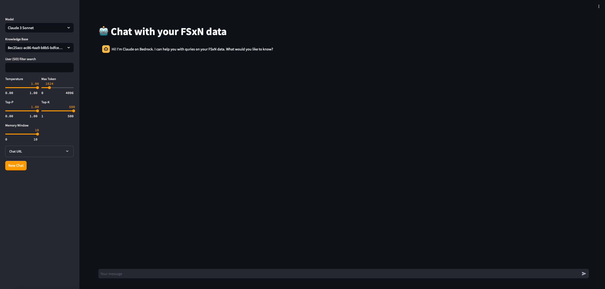

# Chatbot Application
## Overview
This is a chatbot client built using [streamlit](https://streamlit.io). It uses NetApp's Workload Factory Knowledge Bases Vector outputs stored on Amazon FSx for ONTAP filesystem to build a RAG inferencing application that displays inputs and outputs in a chat like interface.  

## Input
This is how the chat window looks like:


### Chat Input
* **Your message**: user prompt/question for the model

### Sidebar Properties:
You can setup most input parameters on the side bar to the left:
* **Model**: AWS Bedrock Model for inferencing. Current supported models are ``Anthropic Claude v2`` and ``Anthropic Claude 3 Sonnet``.
* **User (SID) Filter Search (str)**: User SID to filter the data we access too based on original ACL SID access auth. 
* **Model Arguments**: list of paramers for the foundation model
    * **Temperature**: The amount of randomness injected into the response. Ranges from 0 to 1. Use temp closer to 0 for analytical / multiple choice, and closer to 1 for creative and generative tasks.
    * **Top P**: Use nucleus sampling. In nucleus sampling, Anthropic Claude computes the cumulative distribution over all the options for each subsequent token in decreasing probability order and cuts it off once it reaches a particular probability specified by top_p. You should alter either ``temperature`` or ``top_p``, but not both.
   * **Top K**: Only sample from the top K options for each subsequent token. Use ``top_k`` to remove long tail low probability responses
   * **Max_Tokens**: The maximum number of tokens to generate before stopping.
* **Memory Window**: Only keep last K interaction in the memory of the chat.
* **Chat URL**: path to the Vector DB data files.

### ENV Variable Inputs
* **CHAT_URL**: The vector DB access url.
* **AWS_REGION**: The AWS region.

## Run the Chatbot Application
### Pre-requsites:
#### 1) AWS account
#### 2) NetApp Workload Factory account and Knowledge base created on FSx ONTAP
#### 3) Docker engine installed on workstation
Install docker enginer on your workstation or server to build the chatbot image. 
You can use the [following documentation](https://docs.docker.com/engine/install/). 
#### 4) FSx for NetApp ONTAP filesystem provisioned 
Provision an FSxN filesystem and SVM. You can use the following [AWS documentation](https://docs.aws.amazon.com/fsx/latest/ONTAPGuide/getting-started-step1.html)  
#### 5) IAM role for container execution
Create an IAM role with the folloing action permission to run the container. You can either attach the role as an instance profile or if running on EKS you can use IAM roles for service accounts.
```
{
    "Version": "2012-10-17",
    "Statement": [
        {
            "Sid": "fsxchat",
            "Effect": "Allow",
            "Action": [
                "bedrock:GetFoundationModel",
                "bedrock:InvokeModel",
                "bedrock:InvokeModelWithResponseStream",
                "sts:GetCallerIdentity"
            ],
            "Resource": [
                "*"
            ]
        }
    ]
}
```
6) Start a container runtime enviroment
You can use either EC2 instanaces runnging docker enginer or start an EKS cluster and deploy the image on the cluster.
7) Access point/Loadbalancer
Create an application load balancer or a load balancer service in EKS to point to your chatbot container running in `port 8501`. 

### Build:
Use the following to build the app. Replace `<platform>` with either linux/amd64 for x86 servers or linux/arm64 for ARM servers. 
```
docker build -t <image-name> --platform <platform>  .
```

### Run
Use the following to run the app with docker. replace `<fsx-volume-mount-path>` with the volume mount path that has the LanceDB databases stored. 
```
docker run -e AWS_REGION=<aws-region> -e CHAT_URL='/app/lancedb' -v <fsx-volume-mount-path>:/app/lancedb -p 8501:8501 <image-name>
```

## Author Information

This repository is maintained by the contributors listed on [GitHub](https://github.com/NetApp/aws-fsx-ontap-ai-samples/graphs/contributors).

## License

Licensed under the Apache License, Version 2.0 (the "License").

You may obtain a copy of the License at [apache.org/licenses/LICENSE-2.0](http://www.apache.org/licenses/LICENSE-2.0).

Unless required by applicable law or agreed to in writing, software distributed under the License is distributed on an _"AS IS"_ basis, without WARRANTIES or conditions of any kind, either express or implied.

See the License for the specific language governing permissions and limitations under the License.


